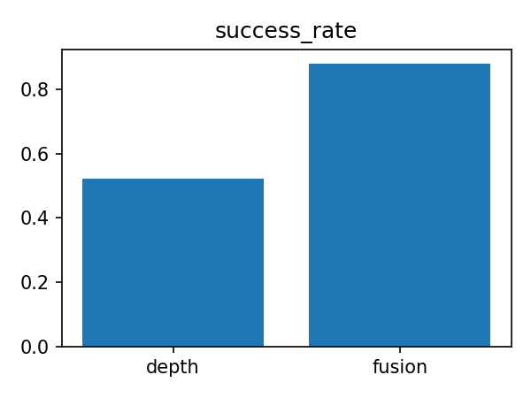
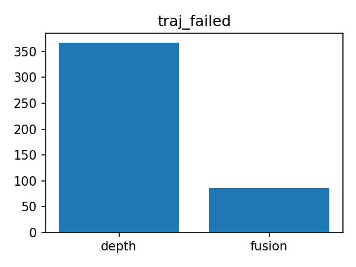
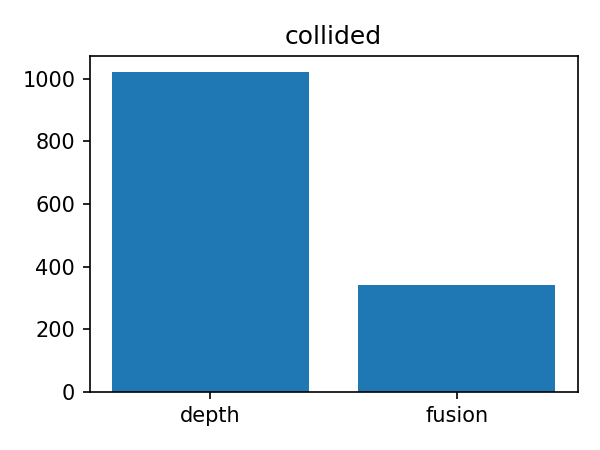
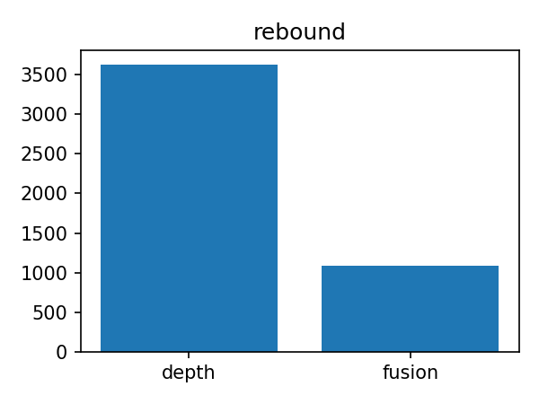
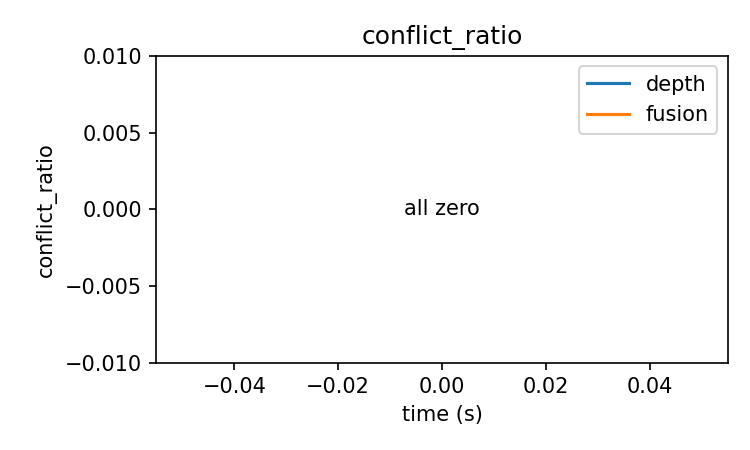

# Usage
## 1. Required Libraries 
* vtk (A dependency library for PCL installation, need to check Qt during compilation)
* PCL

## 2. Prerequisites
It might be due to some incorrect settings in my publish/subscribe configurations. Using ROS2's default FastDDS causes significant lag during program execution. The reason hasn't been identified yet. Please follow the steps below to change the DDS to cyclonedds.

### 2.1 Install cyclonedds
```
sudo apt install ros-humble-rmw-cyclonedds-cpp
```

### 2.2 Change default DDS
```
echo "export RMW_IMPLEMENTATION=rmw_cyclonedds_cpp" >> ~/.bashrc
source ~/.bashrc
```

### 2.3 Verify the change
```
ros2 doctor --report | grep "RMW middleware"
```
If the output shows rmw_cyclonedds_cpp, the modification is successful.

## 3. Running the Code
### 3.1 Launch Rviz
```
ros2 launch ego_planner rviz.launch.py 
```
### 3.2 Run the planning program
Open a new terminal and execute:
* Single drone
```
ros2 launch ego_planner single_run_in_sim.launch.py 
```
* swarm
```
ros2 launch ego_planner swarm.launch.py 
```
* large swarm
```
ros2 launch ego_planner swarm_large.launch.py  
```
* Additional parameters (optional):
    * use_mockamap:Map generation method. Default: False (uses Random Forest), True uses mockamap.
    * use_dynamic:Whether to consider dynamics. Default: False (disabled), True enables dynamics.
```
ros2 launch ego_planner single_run_in_sim.launch.py use_mockamap:=True use_dynamic:=False
```

# 地图融合优化与分析

## 1. 优化背景与目标
本项目对比了 depth-only（单一深度）与 fusion（深度+激光融合）两种地图构建方案，目标是提升轨迹规划的成功率、鲁棒性和稳定性。

## 2. 代码优化说明
- `src/planner/plan_env/src/grid_map.cpp`：对地图融合主循环进行重构，采用数值稳定性设计（如避免除零、溢出），并将距离衰减、权重计算、冲突判定等功能模块化为独立小函数。这种结构化设计不仅提升了代码可读性和可维护性，也有助于后续算法扩展和理论分析。模块化实现便于针对不同融合策略进行实验对比和参数调优。
- `tools/compare_fusion.sh`：将所有实验日志、统计CSV和汇总文件统一保存到 `output/` 目录，实现数据集中管理。这种数据归档方式符合科研数据管理规范，便于结果复现、批量分析和论文撰写时的可追溯性。
- `tools/plot_compare.py`：可视化脚本默认读取和输出到 `output/` 目录，支持自动化批量分析和图表生成。通过标准化数据接口和输出格式，方便进行多组实验结果的横向对比和统计显著性分析。
- 冲突判定与统计逻辑在 `grid_map.cpp` 和 `compare_fusion.sh` 中均有优化，统计更清晰。冲突率等指标的自动化统计为定量评估融合算法的鲁棒性和一致性提供了理论依据，有助于学术交流和成果展示。

## 3. 运行方法
1. 运行地图融合对比脚本，自动生成所有统计数据和日志：
   ```bash
   bash tools/compare_fusion.sh
   ```
   结果文件均保存在 `output/` 文件夹。
2. 运行可视化脚本，自动生成各项指标对比图：
   ```bash
   python tools/plot_compare.py
   ```
   图像文件（如 `fusion_compare_traj_failed.png`）也在 `output/` 文件夹。

## 4. 图表解读示例


- 左侧为 depth-only（单一深度），右侧为 fusion（融合地图）。
- 融合方案成功率更高，说明融合地图能有效提升整体规划表现。


- 左侧为 depth-only（单一深度），右侧为 fusion（融合地图）。
- 融合方案轨迹失败次数显著减少，系统鲁棒性更强。


- 左侧为 depth-only，右侧为 fusion。
- 融合方案碰撞次数更少，说明环境理解更准确，安全性提升。


- 左侧为 depth-only，右侧为 fusion。
- 融合方案反弹次数减少，地图质量更高，路径更顺畅。


- 曲线分别表示 depth-only 和 fusion 方案的冲突率随时间变化。
- 融合方案冲突率整体更低且更稳定，说明多源信息融合后地图一致性更好。

每张图均为 depth-only（左）与 fusion（右或曲线）方案的直接对比，便于直观评估优化效果。

## 5. 其他指标
可视化脚本还会自动生成成功率、碰撞次数、反弹次数、冲突率曲线等图表，便于全面评估优化效果。

---
如需自定义参数或分析流程，可修改脚本参数或联系维护者。